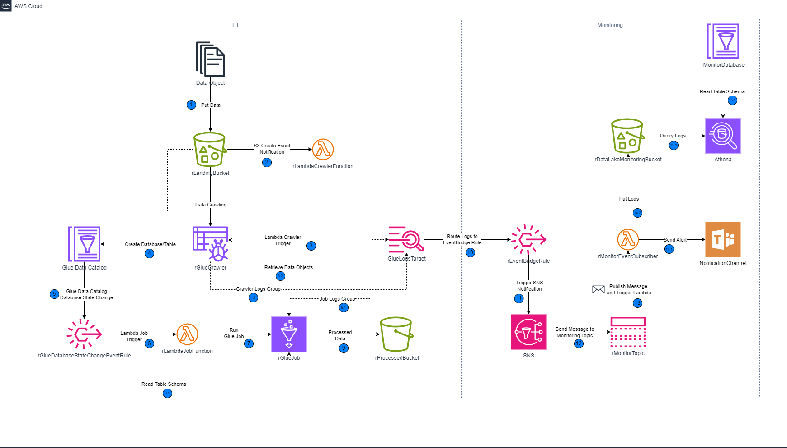
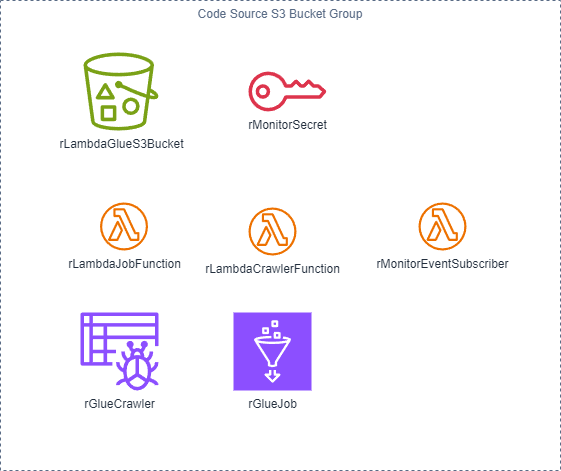
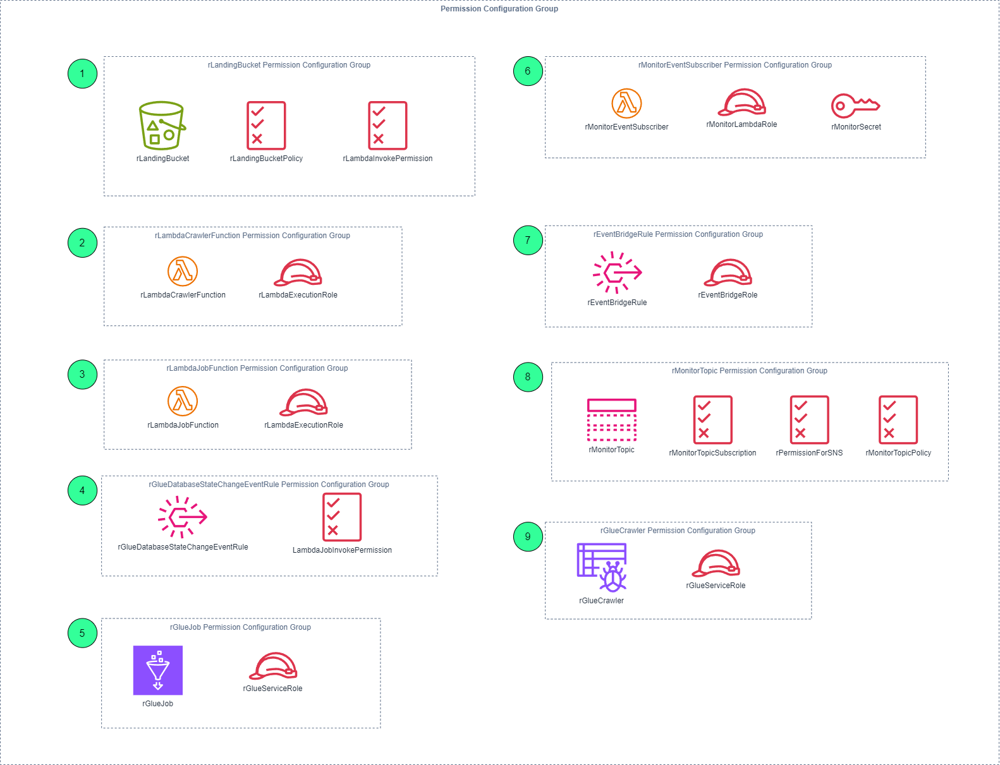

# AWS CloudFormation Samples: ETL and Monitoring

## Table of Contents
1. [📐 Architecture Overview](#architecture-overview)
2. [📝 Steps Explanation](#steps-explanation)
3. [🔒 Permission Configuration Groups](#permission-configuration-groups)
4. [📚 Resource Documentation](#resource-documentation)
5. [🚀 Deployment Instructions](#deployment-instructions)

## Architecture Overview

The architecture consists of an ETL (Extract, Transform, Load) process and a monitoring system implemented using AWS services. The diagram below illustrates the architecture:



### Steps Explanation

### ETL Process

1. **📂 Put Data:**
   - **Action:** Data is uploaded to the `rLandingBucket`.

2. **🔔 S3 Create Event Notification:**
   - **Action:** An event notification is triggered when data is put in the `rLandingBucket`.
   - **Resource:** `rLambdaCrawlerFunction`

3. **🔍 Lambda Crawler Trigger:**
   - **Action:** The `rLambdaCrawlerFunction` initiates a data crawling process.

4. **🗂️ Retrieve Data Objects:**
   - **Action:** The `rGlueCrawler` retrieves data objects from the `rLandingBucket`.

5. **🗃️ Create Database/Table:**
   - **Action:** The `rGlueCrawler` creates or updates the database/table in the Glue Data Catalog.
   - **Resource:** `Glue Data Catalog`

6. **📅 Glue Data Catalog Database State Change:**
   - **Action:** A state change event in the Glue Data Catalog triggers an EventBridge rule.
   - **Resource:** `rGlueDatabaseStateChangeEventRule`

7. **🚀 Lambda Job Trigger:**
   - **Action:** The EventBridge rule triggers the `rLambdaJobFunction` to start a Glue job.
   - **Resource:** `rGlueJob`

8. **🔧 Run Glue Job:**
   - **Action:** The `rGlueJob` runs, processing the data.

9. **📥 Processed Data:**
   - **Action:** The processed data is stored in the `rProcessedBucket`.

### Monitoring System

10. **📋 Route Logs to EventBridge Rule:**
    - **Action:** Logs from Glue jobs are sent to the EventBridge rule.
    - **Resource:** `GlueLogsTarget`

11. **🔔 Trigger SNS Notification:**
    - **Action:** The EventBridge rule triggers an SNS notification.
    - **Resource:** `rEventBridgeRule`

12. **📬 Send Message to Monitoring Topic:**
    - **Action:** The SNS notification is sent to the `rMonitorTopic`.

13. **📡 Publish Message and Trigger Lambda:**
    - **Action:** The `rMonitorTopic` publishes the message and triggers the `rMonitorEventSubscriber`.

14. **🛡️ Put Logs (14.2):**
    - **Action:** The `rMonitorEventSubscriber` puts logs into the `rDataLakeMonitoringBucket`.

15. **🔍 Query Logs:**
    - **Action:** Logs in `rDataLakeMonitoringBucket` are queried using Athena.
    - **Resource:** `Athena`

16. **📨 Send Alert (14.1):**
    - **Action:** The `rMonitorEventSubscriber` sends alerts to a notification channel.
    - **Resource:** `NotificationChannel`

## 📦 Code Storage and Lambda/Glue Job Dependencies

### Code Source S3 Bucket Group



The source code for the Lambda functions and Glue jobs is stored in the `rLambdaGlueS3Bucket`. This bucket holds all the necessary code and dependencies required for the execution of the ETL and monitoring processes.

### 🖥️ Lambda Functions
1. **`rLambdaJobFunction`**
   - **Description:** Executes various ETL tasks.
   - **Code Source:** The code for this Lambda function is stored in `rLambdaGlueS3Bucket`.

2. **`rLambdaCrawlerFunction`**
   - **Description:** Triggers data crawling processes.
   - **Code Source:** The code for this Lambda function is stored in `rLambdaGlueS3Bucket`.

3. **`rMonitorEventSubscriber`**
   - **Description:** Subscribes to monitoring events and sends notifications.
   - **Code Source:** The code for this Lambda function is stored in `rLambdaGlueS3Bucket`.
   - **Layer:** `rRequestsLayer`
     - **Purpose:** Includes the `requests` module to enable HTTP requests for sending notifications via the Microsoft Teams webhook.
   - **Secret:** `rMonitorSecret`
     - **Purpose:** Stores the webhook URL for the Microsoft Teams channel, allowing secure access and usage within the Lambda function.

### ⚙️ Glue Jobs
1. **`rGlueCrawler`**
   - **Description:** Crawls data in S3 and updates the Glue Data Catalog.
   - **Code Source:** The code for this Glue job is stored in `rLambdaGlueS3Bucket`.

2. **`rGlueJob`**
   - **Description:** Processes and transforms data as part of the ETL pipeline.
   - **Code Source:** The code for this Glue job is stored in `rLambdaGlueS3Bucket`.

### 📂 Additional Resources
1. **`rRequestsLayer`**
   - **Description:** A Lambda layer that includes the `requests` module.
   - **Purpose:** Allows the `rMonitorEventSubscriber` Lambda function to make HTTP requests, enabling integration with external services such as Microsoft Teams via webhooks.

2. **`rMonitorSecret`**
   - **Description:** A secret stored in AWS Secrets Manager.
   - **Purpose:** Holds the webhook URL for the Microsoft Teams channel used by the `rMonitorEventSubscriber` Lambda function to send alerts and notifications securely.


## 🔒 Permission Configuration Groups



### 1️⃣ Landing Bucket Permission Configuration Group
- **Resources:** 
  - `rLandingBucket`
  - `rLandingBucketPolicy`
  - `rLambdaInvokePermission`
- **Purpose:** Manages the permissions and policies for the landing S3 bucket.

### 2️⃣ LambdaCrawlerFunction Permission Configuration Group
- **Resources:** 
  - `rLambdaCrawlerFunction`
  - `rLambdaExecutionRole`
- **Purpose:** Manages the permissions for the Lambda function that crawls data.

### 3️⃣ LambdaJobFunction Permission Configuration Group
- **Resources:** 
  - `rLambdaJobFunction`
  - `rLambdaExecutionRole`
- **Purpose:** Manages the permissions for the Lambda function that processes jobs.

### 4️⃣ GlueDatabaseStateChangeEventRule Permission Configuration Group
- **Resources:** 
  - `rGlueDatabaseStateChangeEventRule`
  - `LambdaJobInvokePermission`
- **Purpose:** Manages the EventBridge rule for Glue database state changes.

### 5️⃣ GlueJob Permission Configuration Group
- **Resources:** 
  - `rGlueJob`
  - `rGlueServiceRole`
- **Purpose:** Manages the Glue job and its service role.

### 6️⃣ MonitorEventSubscriber Permission Configuration Group
- **Resources:** 
  - `rMonitorEventSubscriber`
  - `rMonitorLambdaRole`
  - `rMonitorSecret`
- **Purpose:** Manages the Lambda function for monitoring events, its execution role, and the secret storing the Microsoft Teams webhook URL.

### 7️⃣ EventBridgeRule Permission Configuration Group
- **Resources:** 
  - `rEventBridgeRule`
  - `rEventBridgeRole`
- **Purpose:** Manages the permissions for EventBridge rules.

### 8️⃣ MonitorTopic Permission Configuration Group
- **Resources:** 
  - `rMonitorTopic`
  - `rMonitorTopicSubscription`
  - `rPermissionForSNS`
  - `rMonitorTopicPolicy`
- **Purpose:** Manages the SNS topic for monitoring, its subscriptions, and the required permissions.

### 9️⃣ GlueCrawler Permission Configuration Group
- **Resources:** 
  - `rGlueCrawler`
  - `rGlueServiceRole`
- **Purpose:** Manages the Glue crawler and its service role.

## 📚 Resource Documentation

### Overview
This repository contains three main CloudFormation templates that set up different parts of the ETL and monitoring system. Additionally, it includes scripts for managing the deployment of these templates.

### Templates
1. **sdl-foundation**

| **Resource**               | **Associated Resources**                    |
|----------------------------|----------------------------------------------|
| `rLambdaGlueS3Bucket`      | -                                            |
| `oLambdaGlueS3BucketName`  | `rLambdaGlueS3Bucket`                        |

   - **Description:** This template creates the foundational resources, including the S3 bucket (`rLambdaGlueS3Bucket`) that stores the Lambda and Glue job scripts. This bucket is part of the Code Source S3 Bucket group.
   - **Files:**
     - `template.yaml`: CloudFormation template to create foundational resources.
     - `parameters.json`: Parameters file for customizing the stack deployment.
   - **Deployment:** 
     - Use the provided scripts to create, update, or delete the stack.

2. **sdl-etl-jobs**

| **Resource**                     | **Associated Resources**                                         |
|----------------------------------|-------------------------------------------------------------------|
| `rLandingBucket`                 | `rLandingBucketPolicy`, `rLambdaInvokePermission`                |
| `rProcessedBucket`               | -                                                                |
| `rLambdaExecutionRole`           | `rLambdaCrawlerFunction`, `rLambdaJobFunction`                   |
| `rLambdaCrawlerFunction`         | `rLambdaExecutionRole`, `rLambdaInvokePermission`                |
| `rLambdaJobFunction`             | `rLambdaExecutionRole`, `LambdaJobInvokePermission`              |
| `rLambdaInvokePermission`        | `rLambdaCrawlerFunction`, `rLandingBucket`                       |
| `LambdaJobInvokePermission`      | `rLambdaJobFunction`, `rGlueDatabaseStateChangeEventRule`        |
| `rLandingBucketPolicy`           | `rLandingBucket`                                                 |
| `rGlueCrawler`                   | `rGlueServiceRole`                                               |
| `rGlueDatabaseStateChangeEventRule`| `rGlueCrawler`, `rLambdaJobFunction`                           |
| `rGlueJob`                       | `rGlueServiceRole`                                               |
| `rGlueServiceRole`               | `rGlueJob`, `rGlueCrawler`                                       |
| `oGlueCrawlerName`               | `rGlueCrawler`                                                   |
| `oGlueJobName`                   | `rGlueJob`                                                       |
| `oLandingBucketName`             | `rLandingBucket`                                                 |
| `oProcessedBucketName`           | `rProcessedBucket`                                               |

   - **Description:** This template contains the deployment of the ETL architecture, including the Lambda functions, Glue crawlers, and Glue jobs that make up the ETL process.
   - **Files:**
     - `template.yaml`: CloudFormation template to deploy the ETL process.
     - `parameters.json`: Parameters file for customizing the stack deployment.
   - **Structure:**
     - `glue/script/src`: Contains Glue job scripts.
     - `lambda`: Contains Lambda function code.
   - **Deployment:** 
     - Use the provided scripts to create, update, or delete the stack.

3. **sdl-monitoring**

| **Resource**              | **Associated Resources**                                                                                     |
|---------------------------|--------------------------------------------------------------------------------------------------------------|
| `rDataLakeMonitoringBucket` | -                                                                                                          |
| `rMonitorSecret`          | `rMonitorEventSubscriber`                                                                                    |
| `rMonitorTopic`           | `rMonitorTopicPolicy`, `rMonitorTopicSubscription`                                                           |
| `rMonitorTopicPolicy`     | `rMonitorTopic`                                                                                              |
| `rMonitorTopicSubscription`| `rMonitorTopic`                                                                                            |
| `rPermissionForSNS`       | `rMonitorEventSubscriber`                                                                                    |
| `rMonitorLambdaRole`      | `rMonitorEventSubscriber`                                                                                    |
| `rRequestsLayer`          | `rMonitorEventSubscriber`                                                                                    |
| `rMonitorEventSubscriber` | `rMonitorLambdaRole`, `rPermissionForSNS`, `rRequestsLayer`, `rMonitorSecret`                                |
| `rEventBridgeRole`        | `rEventBridgeRule`                                                                                           |
| `rEventBridgeRule`        | `rEventBridgeRole`                                                                                           |
| `rMonitorDatabase`        | -                                                                                                            |
| `rMonitorTable`           | -                                                                                                            |
| `oMonitoringBucketName`   | `rDataLakeMonitoringBucket`                                                                                  |
| `oMonitorLambdaFunction`  | `rMonitorEventSubscriber`                                                                                    |
| `oAthenaDatabaseName`     | `rMonitorDatabase`                                                                                           |
| `oAthenaTableName`        | `rMonitorTable`                                                                                              |

   - **Description:** This template sets up the monitoring system, including EventBridge rules, SNS topics, and Lambda functions for monitoring and alerting.
   - **Files:**
     - `template.yaml`: CloudFormation template to deploy the monitoring system.
     - `parameters.json`: Parameters file for customizing the stack deployment.
   - **Structure:**
     - `lambda`: Contains Lambda function code for monitoring.
   - **Deployment:** 
     - Use the provided scripts to create, update, or delete the stack.

## 🚀 Deployment Process

### 📥 Clone the Repository

First, you need to clone the repository to your local machine:

```sh
git clone https://github.com/ojmarte/aws-cloudformation-samples.git
cd aws-cloudformation-samples
```

### 🔑 Grant Execution Permission

Ensure the scripts have execution permissions. Run the following command to grant the necessary permissions:

```sh
chmod +x scripts/create/main.sh
chmod +x scripts/delete/main.sh
chmod +x scripts/data-population/upload-data.sh
```

### 🛠️ Create the Stacks

To create the CloudFormation stacks, simply run the `main.sh` script located in the `scripts/create` directory:

```sh
./scripts/create/main.sh
```

This script will deploy the foundational resources, ETL jobs, and monitoring system as described in the templates.

### 🗑️ Delete the Stacks

If you need to delete the stacks, run the `main.sh` script located in the `scripts/delete` directory:

```sh
./scripts/delete/main.sh
```

This will remove all the stacks created by the deployment process.

### 📊 Test the ETL Process

Once all the stacks are created in CloudFormation, you need to run the `upload-data.sh` script in the `scripts/data-population` directory to test the process. This will put objects into the `rLandingBucket` and start the ETL process:

```sh
./scripts/data-population/upload-data.sh
```
